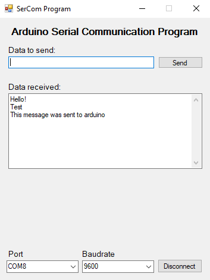

# Arduino Serial Communication App
Windows Forms Application for serial communication with Arduino.
User enter some messages and send to Arduino via serial port, the program will display back the data received from arduino.

## Program Details
* Build in Visual Studio 2019
* Windows Forms App (.NET Framework) C# language
* .NET Framework 4.5

## Arduino
* Arduino IDE 1.8.13
* Tested on Arduino UNO

# Documentations

